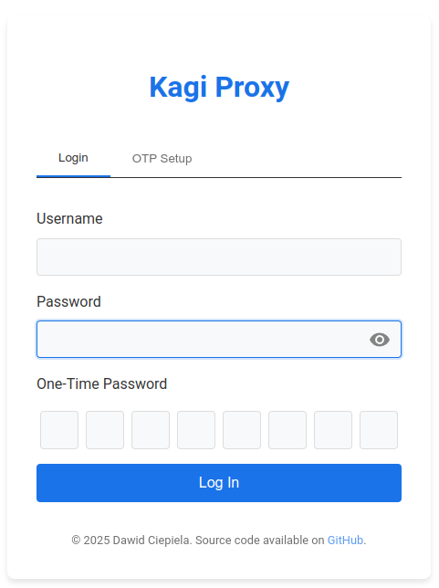

# kagi-proxy

Proxy service for [kagi.com](https://kagi.com). [kagi.com](https://kagi.com) offers a **search engine** as payware which is less vigilantly subjected to questionable SEO practices. Furthermore, it offers **AI assistant** service. The **AI assistant** ships most recent available GPT solutions under one subscription, e.g.:

- Anthropic: _Claude 3.5 Sonnet_
- OpenAI: _GPT 4o_
- Google: _Gemini Pro_
- Meta: _Llama 3_

The subscription is around 25$ for both the unlimited search engine and AI assistant services. Family plan is provided as well, whereas the fee round up to 20$ base rate + 15$ for each member. I wrote a simple proxy service to make my personal [kagi.com](https://kagi.com) subscription shareable with a limited number of people. I provide a reversed proxy behind TLS, basic authentication scheme, CSRF and DDoS protection by employing request throttling. I interfere with the kagi.com interface vie mutation observation and JS injection to provide a seamless user experience.

Proxy is exposed behind [kagi.sarumaj.com](https://kagi.sarumaj.com):

<p align="center" width="100%">
    <a href="https://kagi.sarumaj.com" target="_blank">
        
    </img></a>
</p>

In the case, you are interested to run the proxy yourself, you need to setup a VM in the cloud and configure DNS to support wildcard domains corresponding to `*.kagi.com` and `kagi.com`. The proxy web service is freely configurable via its CLI:

```bash
Usage of kagi-proxy:
  -limit-burst uint
        burst size for rate limiting (default 12)
  -limit-rps float
        requests per second for rate limiting (default 90)
  -port uint
        port to listen on (default 8080)
  -proxy-host string
        proxy domain (default "kagi.com")
  -proxy-otp-secret string
        OTP encryption secret for the proxy session (default "test")
  -proxy-pass string
        proxy user password (default "pass")
  -proxy-session-secret string
        cookie encryption secret for the proxy session (default "test")
  -proxy-user string
        proxy user (default "user")
  -session-token string
        session token for the Kagi website
```
